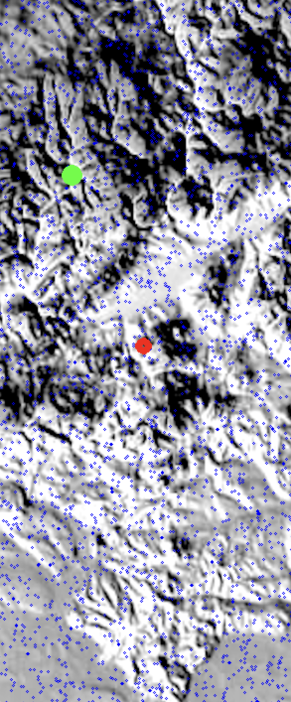
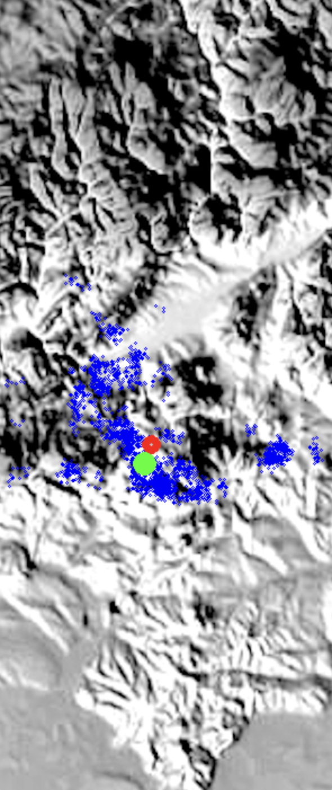
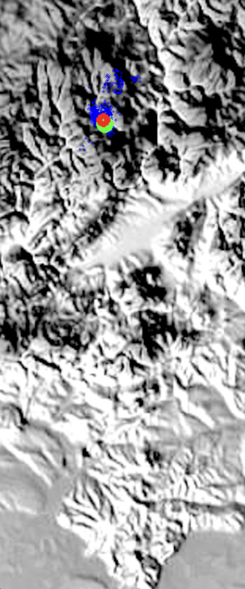

# Robot Localization Particle Filter Simulation

This project is a Python implementation of a Robot Localization system using a Particle Filter algorithm. The primary goal is to demonstrate and simulate the process of estimating a robot's position and orientation (localization) as it moves within a 2D environment. Particle filtering is a powerful technique for solving the localization problem, and this project serves as an educational and illustrative tool to understand its principles.

## Features

- **Robot Motion Simulation**: The code simulates the motion of a robot within a 2D environment. The robot's motion includes forward movement and turning, and it introduces noise to replicate real-world uncertainties.

- **Particle Filter Localization**: A Particle Filter is used to estimate the robot's position and orientation based on sensor measurements and motion commands. Particles represent potential states of the robot, and their weights are updated to converge toward the true state.

- **Visualization**: The simulation provides real-time visualization of the environment, the robot's position, the distribution of particles, and the estimated "best guess" of the robot's location. This visualization aids in understanding the localization process.

- **User Interaction**: Users can control the robot's movement during the simulation using keyboard input. This allows for an interactive experience and demonstrates how the robot's localization evolves as it moves.

## How to Run

### Prerequisites

- Python
- OpenCV
- NumPy

### Installation

1. Clone this repository to your local machine:

   ```
   git clone https://github.com/nirmitparikh8/robot-localization-particle-filter-simulation.git
   ```

2. Navigate to the project directory:

    ```
    cd robot-localization-particle-filter-simulation

    ```

3. Install the required Python libraries:

    ```
    pip3 install opencv-python numpy
    ```


### Usage
1. Run the main.py file to start the robot localization simulation:
    ```python main.py```

2. Use the following keys to control the robot during the simulation:
    - 'w': Move the robot forward.
    - 'a': Turn the robot left.
    - 'd': Turn the robot right.
    - 's': Move the robot backward.

3. Press any other key to halt the simulation.

### Output
The simulation displays the environment, robot, particles, and the estimated position of the robot. The estimated position represents the "best guess" of the robot's localization based on particle filtering. This estimated position is also outputted to the console.

### Visualization

In the visualization of the robot localization, the following elements are present:

- **Green Dot (Robot):**
  - The green dot in the image represents the actual or ground truth position of the robot. It symbolizes the true position and orientation of the robot within the environment.
- **Red Dot (Best Estimated Position):**
  - The red dot symbolizes the estimated position of the robot. 
  - This estimation is derived from the Particle Filter algorithm, which calculates the mean (average) position of all the particles in the particle filter. 
  - The red dot represents the algorithm's best estimate of the robot's position based on the particles' distribution.
- **Particles (Small Tiny Blue Dots):**
  - The small, tiny blue dots on the map represent individual particles used in the Particle Filter algorithm. 
  - Each blue dot corresponds to a potential state or position of the robot within the environment.
  - The distribution of these blue dots provides a visualization of the Particle Filter's belief about the possible positions of the robot. 
  - As the simulation progresses, particles move and spread out to explore and represent the uncertainty associated with the robot's localization. Eventually they end up concentrated around the green dot all clustered up as they have identified the robots position.

#### Images:

1. This is how the simulator starts up: 


2. As you move around, so do the particles:


3. After a while, they end up clustering near the green dot:


### Acknowledgments

This project is based on the concept of Particle Filtering for robot localization. It aims to make the principles of Particle Filtering more accessible and understandable through interactive simulation.


